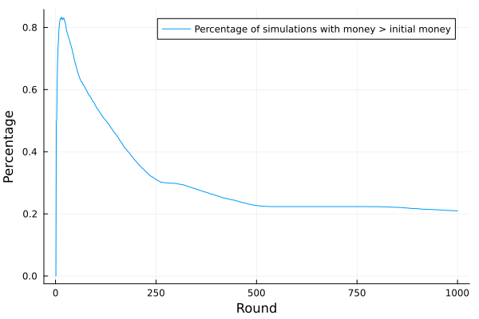

# Simulating the Martingale Betting System
Ole Petersen

Imagine you are in a casino with your best friend and your life savings,
playing roulette. Your friend has an awesome idea: “Let’s always bet on
red. If we lose, we double our bet. Once we win, we have made back all
our losses and we start over with our initial bet. We can’t lose!”

You are a bit sceptical. In every step, you an equal chance of doubling
your bet or losing it, so in expectation, your wealth should stay
constant, right? But what’s the flaw in your friend’s argument?

Let’s simulate the betting strategy and see what happens. You don’t want
to loose it all, so you start with 100$ and begin with the smallest
possible bet of 1$. This is done for up to 1000 rounds. If you cannot
afford the bet anymore, you leave with what is left, dropping out of the
game. This logic is implemented in the following julia code.

``` julia
function simulate(initial_money,minimum_bet,rounds)
    money_by_round = zeros(rounds)
    money = initial_money
    bet=minimum_bet
    for i in 1:rounds
        if money < bet
            money_by_round[i:end] .= money
            break
        end
        money_by_round[i] = money
        money -= bet
        if rand() < 0.5
            # win
            money += 2*bet
            bet = minimum_bet
        else
            # lose
            bet *= 2
        end
    end
    return money_by_round
end
```

We simulate the gameplay 10000 times:

``` julia
num_simulations = 10000
initial_money = 100
minimum_bet = 1
rounds = 1000
simulations = [simulate(initial_money,minimum_bet,rounds) for i in 1:num_simulations]
```

Let us analyse the results. First, we plot a histogram of the wealth of
the player in different rounds in
<a href="#fig-histograms" class="quarto-xref">Figure 1</a>. As we can
see, in the second round, we won or lost equally often, leaving us at +1
or -1 equally likely. However, starting from round 10, a surprising
pattern emerges. In most cases, the net outcome is positive (\>100$).
However, rarely, we lost most of our money (recall that we stop playing
once we cannot use our system anymore). Towards the end, the outcomes
become more and more extreme. We are very likely to drop out, but if we
don’t, we are very likely to have increased our wealth by a factor of 6.


Having understood the probability distributions of the game outcomes, we
can now calculate some higher-level statistics. We measure

-   the mean wealth to find out if we can make money in expectation with
    this strategy
-   the median wealth to find out how a typical player would fare

<a href="#fig-median-mean" class="quarto-xref">Figure 2</a> shows that
the mean wealth stays constant, confirming our initial intuition that
this cannot make money. However, the median wealth increases by more
than 40% in round 100, and then falling to just 50% of our initial
starting value. This is surprising, in the first 100 rounds we are
likely to make a significant profit!


Finally, we will investigate the probability of being net positive at
different stages of the game in
<a href="#fig-profit-probability" class="quarto-xref">Figure 3</a>. And
indeed, after a few rounds, we are almost certain to have made a profit.
However, later on, we most likely loose money. So next time you are in a
casino, you can use martingale to go out net positive very likely, but
be prepared to loose most of it if you stay too long.


