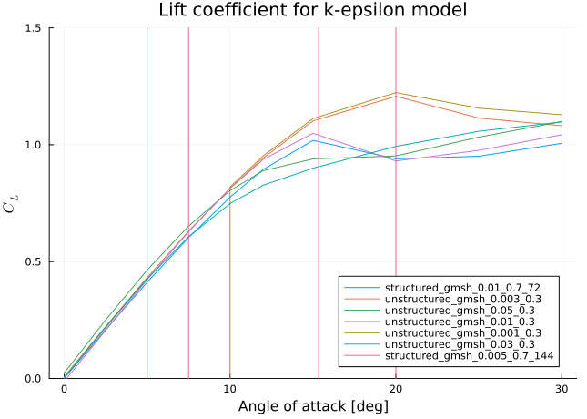

CFD modeling of flow behavior over NACA0012 airfoil for wind turbine
applications
================
Ole Petersen
Dec 7, 2022

# Introduction

The starting point is the [NACA0012 tutorial case in
OpenFoam](https://www.openfoam.com/documentation/guides/latest/doc/verification-validation-naca0012-airfoil-2d.html).
Copy this case to your new working directory. In this tutorial, we will
have a look at how to simulate your custom 2d geometry as the tutorial
is intransparent about how the mesh was generated.

# Mesh generation

We will use `gmsh` to generate the mesh. To do so, we will first
generate the geometry using `gmsh`’s geometry format, use the `gmsh` GUI
to debug the geometry and finally generate the mesh.

## Geometry generation

The geometry will look as follows:


The volume in which fluid is to be simulated is the whole body from
which the aerofoil in the middle is cut out. The circle arc on the left
is the inlet while the outlet is the rectangle on the right.  
The whole geometry generation is done in the
[mesh_generation.jl](case/mesh_generation.jl) script, which outputs a
`gmsh` geometry file [aerofoil.geo](case/aerofoil.geo) that `gmsh` can
read. Note that `gmsh` has its own [geometry scripting
language](https://gmsh.info/doc/texinfo/gmsh.html), but I found it
easier to use a proper programming language like `julia` to generate the
geometry.

### Generating the profile

We will simulate a NACA0012 airfoil, which is described by the following
equation:
$$
y(x) = \pm0.594689181\*(0.298222773\*\sqrt{x} - 0.127125232\*x - 0.357907906\*x^2 + 0.291984971\*x^3 - 0.105174606\*x^4)
$$
Now, we will generate a set of points that describe the profile:

``` julia
y(x)= 0.594689181*(0.298222773*sqrt(x) - 0.127125232*x - 0.357907906*x^2 + 0.291984971*x^3 - 0.105174606*x^4)
n_points_per_side=10 # this would be much higher in the real case
n_aerofoil_points=2*n_points_per_side
io=stdout
for i in 1:n_points_per_side
    x=(i-1)/(n_points_per_side)
    mesh_size=0.005
    println(io,"Point($i) = {$x, $(y(x)), 0.0,$mesh_size};")
end
for i in 1:n_points_per_side
    x=1-(i-1)/(n_points_per_side)
    mesh_size=0.005
    println(io,"Point($(i+n_points_per_side)) = {$(x), $(-y(x)), 0.0,$mesh_size};")
end
```

    Point(1) = {0.0, 0.0, 0.0,0.005};
    Point(2) = {0.1, 0.046561895043862704, 0.0,0.005};
    Point(3) = {0.2, 0.056968557150769476, 0.0,0.005};
    Point(4) = {0.3, 0.05948422462775665, 0.0,0.005};
    Point(5) = {0.4, 0.05738266105317275, 0.0,0.005};
    Point(6) = {0.5, 0.05219019673131475, 0.0,0.005};
    Point(7) = {0.6, 0.04479110070446828, 0.0,0.005};
    Point(8) = {0.7, 0.03570927685952479, 0.0,0.005};
    Point(9) = {0.8, 0.025211311562171167, 0.0,0.005};
    Point(10) = {0.9, 0.013352458679209828, 0.0,0.005};
    Point(11) = {1.0, 1.650594053104193e-17, 0.0,0.005};
    Point(12) = {0.9, -0.013352458679209828, 0.0,0.005};
    Point(13) = {0.8, -0.025211311562171167, 0.0,0.005};
    Point(14) = {0.7, -0.03570927685952479, 0.0,0.005};
    Point(15) = {0.6, -0.04479110070446828, 0.0,0.005};
    Point(16) = {0.5, -0.05219019673131475, 0.0,0.005};
    Point(17) = {0.4, -0.05738266105317275, 0.0,0.005};
    Point(18) = {0.30000000000000004, -0.05948422462775666, 0.0,0.005};
    Point(19) = {0.19999999999999996, -0.05696855715076947, 0.0,0.005};
    Point(20) = {0.09999999999999998, -0.046561895043862704, 0.0,0.005};

The syntax is `Point(i) = {x, y, z, mesh_size};` where `i` is a unique
index of the point, `x`, `y` and `z` are the coordinates and `mesh_size`
is the desired mesh size at this point. Pasting this output into a file
called `aerofoil.geo` (or setting the script up to write its output to
that file like in the [final version](case/mesh_generation.jl) and
running `gmsh aerofoil.geo` will prompt you with the following:


The next critical step is to connect all the points with a spline. The
profile points should be connected with a single spline instead of a set
of hundreds of single lines since this will later enable us to name the
aerofoil surface. This is done by the following code:

``` julia
println(io,"""Spline(1)={1:$n_aerofoil_points,1};""")
```

    Spline(1)={1:20,1};

The syntax is `Spline(i)={p1,p2,...pk};` where `i` is a unique index of
the spline and `pi` are the indices of the points the spline should
connect. `pi:pj` is a shorthand for `pi,pi+1,...,pj`. The `1` at the end
of the line is the first index again, which is needed to close the
spline. The result is the following:


### Generating the bounding box

The next step is to generate the bounding box. This is done by the
following code:

``` julia
bounding_radius=5.0
far_field_mesh_size=0.3
println(io,"Point($(n_aerofoil_points+1)) = {0.0, $(bounding_radius), 0.0, $far_field_mesh_size};")
println(io,"Point($(n_aerofoil_points+2)) = {0.0, $(-bounding_radius), 0.0, $far_field_mesh_size};")
println(io,"Point($(n_aerofoil_points+3)) = {$(-bounding_radius), 0.0, 0.0, $far_field_mesh_size};")
println(io,"Point($(n_aerofoil_points+4)) = {$(bounding_radius), $(bounding_radius), 0.0, $far_field_mesh_size};")
println(io,"Point($(n_aerofoil_points+5)) = {$(bounding_radius), $(-bounding_radius), 0.0, $far_field_mesh_size};")
println(io,"Circle($(n_aerofoil_points+1))= {$(n_aerofoil_points+2), 1, $(n_aerofoil_points+3)};")
println(io,"Circle($(n_aerofoil_points+2))= {$(n_aerofoil_points+3), 1, $(n_aerofoil_points+1)};")
println(io,"Line($(n_aerofoil_points+3)) = {$(n_aerofoil_points+1), $(n_aerofoil_points+4)};")
println(io,"Line($(n_aerofoil_points+4)) = {$(n_aerofoil_points+4), $(n_aerofoil_points+5)};")
println(io,"Line($(n_aerofoil_points+5)) = {$(n_aerofoil_points+5), $(n_aerofoil_points+2)};")
```

    Point(21) = {0.0, 5.0, 0.0, 0.3};
    Point(22) = {0.0, -5.0, 0.0, 0.3};
    Point(23) = {-5.0, 0.0, 0.0, 0.3};
    Point(24) = {5.0, 5.0, 0.0, 0.3};
    Point(25) = {5.0, -5.0, 0.0, 0.3};
    Circle(21)= {22, 1, 23};
    Circle(22)= {23, 1, 21};
    Line(23) = {21, 24};
    Line(24) = {24, 25};
    Line(25) = {25, 22};

You can look up the exact syntax of the commands in the [Gmsh
documentation](https://gmsh.info/doc/texinfo/gmsh.html). The result is
the following:


Next, we want to create a surface that fills the area between the
aerofoil and the bounding box. This is done by the following code:

``` julia
println(io,"Curve Loop(2) = {$(n_aerofoil_points+1):$(n_aerofoil_points+5)};")
println(io,"Curve Loop(3) = {1};")
println(io,"Plane Surface(1) = {2,3};")
```

    Curve Loop(2) = {21:25};
    Curve Loop(3) = {1};
    Plane Surface(1) = {2,3};

We join a set of lines to a loop with `Curve Loop(i) = {p1,p2,...pk};`
where `i` is a unique index of the loop and `pi` are the indices of the
lines the loop should connect. Loop `2` is the bounding box and loop `3`
is the aerofoil. We then join the loops to a surface with
`Plane Surface(i) = {l1,l2,...lk};` where `i` is a unique index of the
surface and `li` are the indices of the loops the surface should
connect. This does not make a visual difference.

### Extruding the geometry

OpenFoam does not allow us to use 2D geometries, so we need to extrude
the geometry in the z-direction. This is done by the following code:

``` julia
println(io,"""
meshThickness=1.0;
surfaceVector[] = Extrude {0, 0, meshThickness} {
    Surface{1};
    Layers{1};
    Recombine;
};
Physical Volume("internalField") = surfaceVector[1];
Physical Surface("frontAndBackPlanes") = {surfaceVector[0],1};
Physical Surface("INLET")={surfaceVector[2],surfaceVector[3]};
Physical Surface("OUTLET")={surfaceVector[5]};
Physical Surface("AIRFOIL")={surfaceVector[7]};
Physical Surface("WALL")={surfaceVector[4],surfaceVector[6]};
""")
```

    meshThickness=1.0;
    surfaceVector[] = Extrude {0, 0, meshThickness} {
        Surface{1};
        Layers{1};
        Recombine;
    };
    Physical Volume("internalField") = surfaceVector[1];
    Physical Surface("frontAndBackPlanes") = {surfaceVector[0],1};
    Physical Surface("INLET")={surfaceVector[2],surfaceVector[3]};
    Physical Surface("OUTLET")={surfaceVector[5]};
    Physical Surface("AIRFOIL")={surfaceVector[7]};
    Physical Surface("WALL")={surfaceVector[4],surfaceVector[6]};

We extrude in the direction of the vector `{0,0,meshThickness}` with
`Extrude {0, 0, meshThickness} {Surface{1};Layers{1};Recombine;};`.
`Surface{1};` tells `gmsh` we want to extrude the surface with the index
one we just created. The `Layers{1}` command tells Gmsh to only generate
one mesh layer. The `Recombine` command does something I do not
understand but is recommended in other tutorials.

Finally, we need to assign names to surfaces in order to be able to
later set boundary conditions in OpenFoam. The keyword `Physical` means
that a name needs to be exported to the mesh. The syntax is
`Physical Surface{"name_i_choose"}={p1,p2,...pk};` where `p1,p2,...pk`
are the indices of the surfaces we want to assign the name to. The same
holds for volumes. The names we choose are `frontAndBackPlanes`,
`INLET`, `OUTLET`, `AIRFOIL` and `WALL`. The names are not important,
but they need to be consistent with the names we use in OpenFoam. The
`Extrude` command returns a list of surfaces it created by the extrusion
as well as the volume it created. The ordering of these values is
described by the
[docs](https://gmsh.info/doc/texinfo/gmsh.html#Extrusions) as follows:

> By default, the list contains the “top” of the extruded entity at
> index 0 and the extruded entity at index 1, followed by the “sides” of
> the extruded entity at indices 2, 3, etc.

Now you see why it is important the aerofoil consists of only one loop:
Else we would have to assign a few hundred surfaces to a physical
surface now. Even now the assignment is not trivial, but you can either
try to keep track of the order in which the lines were added to the
extrusion or use the visibility tool in `gmsh`, go to the tree view,
select only one physical surface and click `Apply`. This will show you
if you assigned the physical surface to the correct surfaces.

## Meshing the geometry

Now we have the geometry ready to be meshed. Running the geometry
generation script will create a file `aerofoil.geo` in the current
directory. We can now run `gmsh` on this file to create the mesh:

``` bash
julia mesh_generation.jl
gmsh -3 aerofoil.geo -format msh2
```

Here, the `-3` flag tells `gmsh` to create a 3D mesh. The `-format msh2`
flag tells `gmsh` to create a mesh in the `msh2` format instead of the
newest `msh4` format. This is necessary since else we will not be able
to convert the mesh to the `OpenFoam` format, resulting in hard-to-debug
errors. The resulting mesh file `aerofoil.msh` can be viewed by typing
`gmsh aerofoil.msh` in the terminal. The result should look like this:


## Converting the mesh to OpenFoam format

Now we have the mesh in the `msh2` format by running

``` bash
# load OpenFoam into context
source /opt/OpenFOAM/OpenFOAM-10/etc/bashrc
gmshToFoam aerofoil.msh
```

This will create a directory `constant/polyMesh` with the mesh in the
`OpenFoam` format. Now have a look at the `constanc/boundary` file. It
should look like this:

``` txt
FoamFile
{
    format          ascii;
    class           polyBoundaryMesh;
    location        "constant/polyMesh";
    object          boundary;
}
// * * * * * * * * * * * * * * * * * * * * * * * * * * * * * * * * * * * * * //


5 // entry0
(
    frontAndBackPlanes
    {
        type            patch;
        physicalType    patch;
        nFaces          33288;
        startFace       24701;
    }
    INLET
    {
        type            patch;
        physicalType    patch;
        nFaces          54;
        startFace       57989;
    }
    WALL
    {
        type            patch;
        physicalType    patch;
        nFaces          34;
        startFace       58043;
    }
    OUTLET
    {
        type            patch;
        physicalType    patch;
        nFaces          34;
        startFace       58077;
    }
    AIRFOIL
    {
        type            patch;
        physicalType    patch;
        nFaces          408;
        startFace       58111;
    }
)
```

Now we need to assign the types of the `frontAndBackPlanes` to `empty`,
telling `OpenFoam` that the geometry is “pseudo-2d” and that of the
`AIRFOIL` to `wall`. We can do this either by editing the file manually
or by running

``` bash
function setBoundaryType {
    foamDictionary constant/polyMesh/boundary -entry entry0/$1/type -set $2
}
setBoundaryType frontAndBackPlanes empty
setBoundaryType AIRFOIL wall 
```

And now we have our mesh!

# Setting boundary conditions

Boundary conditions are set in the `0` directory. Here we reference the
names we gave to the physical surfaces earlier and set values
accordingly. For example the velocity boundary conditions are set as
follows:

``` txt
//0/U
FoamFile
{
    format          ascii;
    class           volVectorField;
    object          U;
}
// * * * * * * * * * * * * * * * * * * * * * * * * * * * * * * * * * * * * * //

dimensions      [ 0 1 -1 0 0 0 0 ];

angle           10;

magnitude       51.4815;

radAngle        #calc "degToRad($angle)";

internalField   uniform ( #calc "$magnitude*cos($radAngle)" #calc "$magnitude*sin($radAngle)" 0 );

boundaryField
{
    INLET
    {
        type            freestreamVelocity;
        freestreamValue $internalField;
    }
    OUTLET
    {
        type            freestreamVelocity;
        freestreamValue $internalField;
    }
    WALL
    {
        type            freestreamVelocity;
        freestreamValue $internalField;
    }
    AIRFOIL
    {
        type            noSlip;
    }
    frontAndBackPlanes
    {
        type            empty;
    }
}
```

The `#calc` macro can be used to evaluate expressions and I use it to be
able to set the angle of attack. For the other fields, have a look at
the [repository](case/0).

# Running the simulation

Now we can run the simulation by running

``` bash
./Allclean
./Allrun
```

in the `case` directory. Now calling `paraFoam -builtin` will open a
window with the results, here showing the pressure field at 10° angle of
attack:


# Postprocessing

Finally, we might want to compute force coefficients. To do so, we edit
`system/controlDict`:

``` txt
...

timePrecision   6;

runTimeModifiable true;
// here the new code starts
functions
{
    calcForceCoefficients
    {
        type            forceCoeffs;
        functionObjectLibs ( "libforces.so" );
        enabled         true;
        writeControl   outputTime;
        p               p;
        U               U;
        rhoInf 1.225;
        rho         rhoInf;
        CofR  (0 0 0);
        patches (AIRFOIL);
        liftDir (0 1 0);
        dragDir (1 0 0);
        magUInf 51.4815;
        pitchAxis       (0 0 1);
        lRef            1;
        Aref           1.0;
    }
}
```

We are specifying that force coefficients should be computed from the
pressure and velocity fields at a certain density, the center of
rotation is in the origin (for calculating rotation coefficients), we
want to compute forces on the `AIRFOIL` patch/surface, the lift
direction is in the y-direction, the drag direction is in the
x-direction, the freestream velocity is 51.4815 m/s, the pitch axis is
in the z-direction, the reference length is 1 m and the reference area
is 1*m*<sup>2</sup> (1m length, the extrusion depth is 1m). Now we can
run the simulation again and the results will be written to
`postProcessing/forceCoeffs/0/forceCoeffs.dat`. The results should look
like this for an angle of attack of 10°:

``` txt
# Force coefficients
# liftDir     : (0.000000e+00 1.000000e+00 0.000000e+00)
# dragDir     : (1.000000e+00 0.000000e+00 0.000000e+00)
# pitchAxis   : (0.000000e+00 0.000000e+00 1.000000e+00)
# magUInf     : 5.148150e+01
# lRef        : 1.000000e+00
# Aref        : 1.000000e+00
# CofR        : (0.000000e+00 0.000000e+00 0.000000e+00)
# Time          Cm              Cd              Cl              Cl(f)           Cl(r)         
0               1.005199e-04    8.689213e-04    2.007876e-04    2.009136e-04    -1.260811e-07
50              2.035919e-01    -4.819210e-02   7.422555e-01    5.747196e-01    1.675359e-01
100             2.156512e-01    -7.982419e-02   8.268958e-01    6.290991e-01    1.977967e-01
150             1.989127e-01    -8.818876e-02   8.174411e-01    6.076333e-01    2.098078e-01
200             1.937071e-01    -9.057140e-02   8.183314e-01    6.028728e-01    2.154586e-01
250             1.982154e-01    -9.338277e-02   8.350128e-01    6.157218e-01    2.192910e-01
300             2.051837e-01    -9.658069e-02   8.551922e-01    6.327799e-01    2.224124e-01
350             2.116860e-01    -9.937373e-02   8.728818e-01    6.481269e-01    2.247549e-01
400             2.160577e-01    -1.015911e-01   8.854153e-01    6.587653e-01    2.266499e-01
450             2.185094e-01    -1.031260e-01   8.930907e-01    6.650547e-01    2.280360e-01
500             2.198577e-01    -1.040943e-01   8.976094e-01    6.686624e-01    2.289470e-01
```

The coefficients are calculated at each time step of the solver (a time
step is more of an iterative step since the simulation is steady). Note
that the lift- and drag direction are not set according to the
convention, normally the lift is perpendicular to the free stream
velocity and not to the aerofoil. One can either fix this in the
configuration or by rotating lift and drag by the angle of attack after
the simulation, which is done here.

# Results

``` julia
using DataFrames,CSV
liftData=CSV.read("case/allResults.dat",DataFrame,header=false)[:,[3,4]]|>Matrix
tangentCoeffs=liftData[:,1]
normalCoeffs=liftData[:,2]
angles=[0.001,5,10,15,20]
using Plots
liftCoeffs=cos.(angles).*normalCoeffs.+sin.(angles).*tangentCoeffs
plot(angles,normalCoeffs)
```


