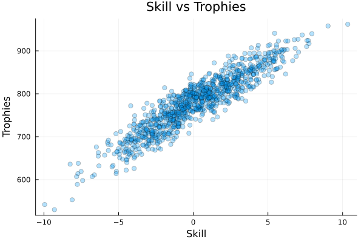
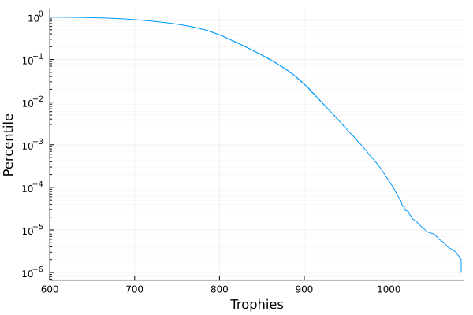
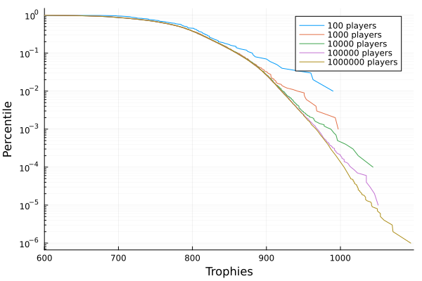
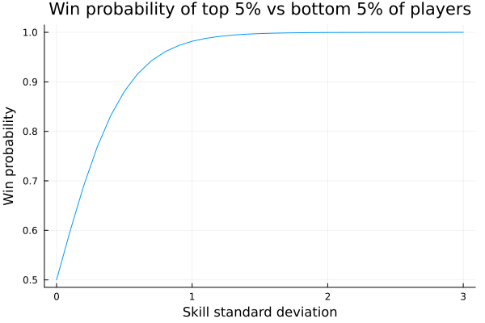
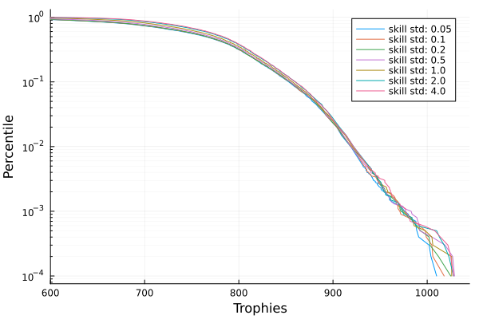
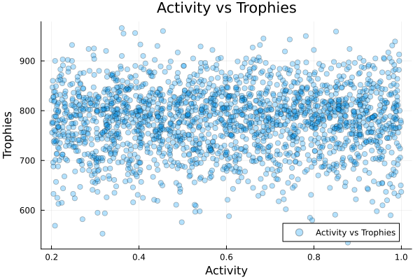

# Are you in the top 1% of brawl stars players?
Dominik Moser, Ole Petersen

Have you ever wondered how good you are at the game [Brawl
Stars](https://supercell.com/en/games/brawlstars/)? Are you in the top
1% of players? In this post, we will find out by simulating the game
with a million players using [Julia](https://julialang.org/).

## Our model

Brawl stars is a multiplayer game. We will analyze the `3v3` game mode
where two teams of three players each fight against each other. We are
primarily interested in top players; therefore, we will assume that all
brawlers are maxed out. The strength of a player is assumed to be soley
determined by a single number, the skill level, which is constant over
all games. Players have a trophy cound, changing over the rounds.

We simplistically assume that the game is played in discrete global
rounds. For each round, each player joins with a probability of
`activity_level`, which is individual for each player. If a player has
an activity level of 1, they play in every round.

This leaves us with the following model:

``` julia
using Distributions
using Random

mutable struct Player
    trophies::Int
    skill::Float64
    activity::Float64
    Player(skill_dist=Normal(0, 3),activity_dist=Uniform(0.2, 1)) = new(0, rand(skill_dist), rand(activity_dist))
end
```

Here, we assume that the skill level of the players is distributed as
𝒩(*μ*=0,*σ*=3) and the activity level is distributed as 𝒰(0.2,1).

Consequently, the players that are active in a round are drawn as
follows:

``` julia
function sample_players_in_round(players::Vector{Player})
    mask = [rand(Bernoulli(p.activity)) for p in players]
    return players[mask]
end
```

Now, let us consider the outcome of a game. We assume that the strength
of a team is the average skill of its players. If two teams with average
skills *m*<sub>1</sub> and *m*<sub>2</sub> play against each other, we
model the probability of team 1 winning as
$$
P(\text{team 1 wins}) = \frac{1}{1 + \exp(m_2 - m_1)}.
$$
This is implemented as follows:

``` julia
function play(g1::AbstractVector{Player}, g2::AbstractVector{Player})
    m1 = mean([p.skill for p in g1])
    m2 = mean([p.skill for p in g2])
    p_team_1_wins = 1 / (1 + exp(m2 - m1))
    return rand(Bernoulli(p_team_1_wins))
end
```

How are the players rewarded or penalized after a game? This data is
publicly accesible:

<table>
<thead>
<tr class="header">
<th>min trophies</th>
<th>max trophies</th>
<th>win trophy bonus</th>
<th>loss trophy penalty</th>
</tr>
</thead>
<tbody>
<tr class="odd">
<td>0</td>
<td>49.0</td>
<td>8</td>
<td>0</td>
</tr>
<tr class="even">
<td>50</td>
<td>99.0</td>
<td>8</td>
<td>-1</td>
</tr>
<tr class="odd">
<td>100</td>
<td>199.0</td>
<td>8</td>
<td>-2</td>
</tr>
<tr class="even">
<td>200</td>
<td>299.0</td>
<td>8</td>
<td>-3</td>
</tr>
<tr class="odd">
<td>300</td>
<td>399.0</td>
<td>8</td>
<td>-4</td>
</tr>
<tr class="even">
<td>400</td>
<td>499.0</td>
<td>8</td>
<td>-5</td>
</tr>
<tr class="odd">
<td>500</td>
<td>599.0</td>
<td>8</td>
<td>-6</td>
</tr>
<tr class="even">
<td>600</td>
<td>699.0</td>
<td>8</td>
<td>-7</td>
</tr>
<tr class="odd">
<td>700</td>
<td>799.0</td>
<td>8</td>
<td>-8</td>
</tr>
<tr class="even">
<td>800</td>
<td>899.0</td>
<td>7</td>
<td>-9</td>
</tr>
<tr class="odd">
<td>900</td>
<td>999.0</td>
<td>6</td>
<td>-10</td>
</tr>
<tr class="even">
<td>1000</td>
<td>1099.0</td>
<td>5</td>
<td>-11</td>
</tr>
<tr class="odd">
<td>1100</td>
<td>1199.0</td>
<td>4</td>
<td>-12</td>
</tr>
<tr class="even">
<td>1200</td>
<td>Inf</td>
<td>3</td>
<td>-12</td>
</tr>
</tbody>
</table>

So now, let us write a function that returns the new trophy count of the
players after a game. Since this is run billions of times, we
pre-compute the result in bins of 50 trophies:

``` julia
num_bins=1200÷50+1
to_bin(trophies::Int)=1+min(trophies,1200) ÷ 50
win_trophies_by_bin=zeros(Int,num_bins)
loss_trophies_by_bin=zeros(Int,num_bins)
for trophy in 0:50:1200
    df_row=first(filter(row->row[1]<=trophy<=row[2],eachrow(trophy_changes)))
    win_trophies_by_bin[to_bin(trophy)]=df_row["win trophy bonus"]
    loss_trophies_by_bin[to_bin(trophy)]=df_row["loss trophy penalty"]
end
function get_trophy_change(trophies::Int, win::Bool)
    trophy_bin = to_bin(trophies)
    return win ? win_trophies_by_bin[trophy_bin] : loss_trophies_by_bin[trophy_bin]
end
@assert all(get_trophy_change.(trophy_changes[:,"min trophies"], true) .== trophy_changes[:,"win trophy bonus"])
@assert all(get_trophy_change.(trophy_changes[:,"min trophies"], false) .== trophy_changes[:,"loss trophy penalty"])
println("Trophy change at 543 trophies after a win: ", get_trophy_change(543, true))
println("Trophy change at 543 trophies after a loss: ", get_trophy_change(543, false))
```

    Trophy change at 543 trophies after a win: 8
    Trophy change at 543 trophies after a loss: -6

Next, let us implement a round of the game. We first get the active
players in this round and sort them by their trophy cound. This allows
us to pair the players with similar trophy levels: We split the list of
active players in chunks of size `6=2*team_size`. Since the list is
sorted, each group of 6 has a similar trophy count. We then permute the
players in the group randomly and assign the first three to group 1 and
the last three to group 2. The trophies of the players are then updated
accordingly. Each group is executed in parallel using
`Threads.@threads`:

``` julia
function step!(players::Vector{Player}, team_size::Int=3)
    players_in_round = sample_players_in_round(players)
    sorted_players = sort(players_in_round, by=p -> p.trophies)
    permutation = randperm(2 * team_size)
    Threads.@threads for i in 1:(2*team_size):(length(sorted_players)-2*team_size)
        @views begin
            shuffled_players = sorted_players[i:i+2*team_size-1][permutation]
            team1 = shuffled_players[1:team_size]
            team2 = shuffled_players[team_size+1:end]
            @assert length(team1) == length(team2) == team_size
            team1_wins = play(team1, team2)
            for p in team1
                p.trophies += get_trophy_change(p.trophies, team1_wins)
            end
            for p in team2
                p.trophies += get_trophy_change(p.trophies, !team1_wins)
            end
        end
    end
end
```

Now, let us simulate a few rounds of the game:

``` julia
num_players = 1000000
num_rounds = 1000
players = [Player() for i in 1:num_players]
for round in 1:num_rounds
    step!(players)
end
```

First, we would like to find out the correlation between the skill level
and the trophy count.
<a href="#fig-skills-vs-trophies" class="quarto-xref">Figure 1</a> shows
the result of a simulation with 1 million players. It is visible that a
higher skill level is clearly correlated with a higher trophy count.

``` julia
using Plots
players_to_plot = players[1:10000]
scatter([p.skill for p in players_to_plot], [p.trophies for p in players_to_plot], label="Skill vs Trophies", xlabel="Skill", ylabel="Trophies", title="Skill vs Trophies",alpha=0.1, legend=false)
```



Next, let us find out what we are interested in: the top 1% of players.
To do so, we sort the players by their trophy count and plot how many
players have more than a certain number of trophies in
<a href="#fig-trophies-cdf" class="quarto-xref">Figure 2</a>.

``` julia
trophies=[p.trophies for p in players]
trophies=sort(trophies)
percent_better=1.0 .- (1:num_players) ./num_players
plot(trophies[1:end-1], percent_better[1:end-1], label="Trophies", xlabel="Trophies", ylabel="Percentile", title="CDF of trophies", yscale=:log10, xlims=(600,maximum(trophies)),yminorgrid=true, legend=false)
```



In the following table you can see that you need 864 trophies to be in
the top 1% of players:

``` julia
percentiles_to_list=[10,5,2,1,0.1,0.01,0.001]
indices=[ceil(Int,(1-percentile/100)*num_players) for percentile in percentiles_to_list]
trophies_at_percentiles=trophies[indices]
df=DataFrame("Percentile (%)"=>percentiles_to_list,"Trophies"=>trophies_at_percentiles)
markdown_table(df)
```

<table>
<thead>
<tr class="header">
<th>Percentile (%)</th>
<th>Trophies</th>
</tr>
</thead>
<tbody>
<tr class="odd">
<td>10.0</td>
<td>799</td>
</tr>
<tr class="even">
<td>5.0</td>
<td>819</td>
</tr>
<tr class="odd">
<td>2.0</td>
<td>844</td>
</tr>
<tr class="even">
<td>1.0</td>
<td>862</td>
</tr>
<tr class="odd">
<td>0.1</td>
<td>907</td>
</tr>
<tr class="even">
<td>0.01</td>
<td>942</td>
</tr>
<tr class="odd">
<td>0.001</td>
<td>983</td>
</tr>
</tbody>
</table>

Next, let us test how this curve depends on the number of players.
<a href="#fig-trophies-cdf-players" class="quarto-xref">Figure 3</a>
shows an interesting result: If there are more players in the game, you
not only need more trophies to be on a certain *absolute* position, but
also to be in a certain *relative* position. Based on
[this](https://activeplayer.io/brawl-stars/), brawl stars has around a
million daily active players, so the initial plot is the most relevant.

``` julia
p=plot(xlabel="Trophies", ylabel="Percentile", title="CDF of trophies", yscale=:log10, yminorgrid=true)
num_rounds=1000
for num_players in [100,1000, 10000, 100000, 1000000]
    players = [Player() for i in 1:num_players]
    for round in 1:num_rounds
        step!(players)
    end
    trophies=[p.trophies for p in players]
    trophies=sort(trophies)
    percent_better=1.0 .- (1:num_players) ./num_players
    plot!(p,trophies[1:end-1], percent_better[1:end-1], label="$num_players players", xlims=(600,maximum(trophies)))
end
display(p)
```



Next, let us find out how the curve depends on the standard deviations
of the skill level. This model parameter is crucial since the formula
for the probability of winning a game depends on the average skill level
of the team members:
$$
P(\text{team 1 wins}) = \frac{1}{1 + \exp(m_2 - m_1)}.
$$
The standard deviation controls how likely the best players win against
the worst players. Let us see how likely the top 5% of players win
against the bottom 5% of players for different standard deviations, as
depicted in <a href="#fig-win-probability-top-vs-bottom"
class="quarto-xref">Figure 4</a>.

``` julia
# The top 5% of players have a skill of 2 standard deviations above the mean, while the bottom 5% have a skill of 2 standard deviations below the mean
p_win(std) = 1 / (1 + exp(-2*std+(-2*std)))
stds=0:0.1:3
plot(stds, p_win.(stds), label="Win probability of top 5% vs bottom 5%", xlabel="Skill standard deviation", ylabel="Win probability", title="Win probability of top 5% vs bottom 5% of players", legend=false)
```



Running the simulation with different standard deviations shows that its
influence is surprisingly minimal, as shown in
<a href="#fig-trophies-cdf-variance" class="quarto-xref">Figure 5</a>.
The curves are almost identical except for very high trophy counts. This
means our result is robust against changes in this somehow arbitrary
parameter.

``` julia
p=plot(xlabel="Trophies", ylabel="Percentile", title="CDF of trophies", yscale=:log10, yminorgrid=true)
num_players=10000
num_rounds=1000
for std in [0.05, 0.1, 0.2, 0.5, 1, 2,4]
    players = [Player(Normal(0,std)) for i in 1:num_players]
    for round in 1:num_rounds
        step!(players)
    end
    trophies=[p.trophies for p in players]
    trophies=sort(trophies)
    percent_better=1.0 .- (1:num_players) ./num_players
    plot!(p,trophies[1:end-1], percent_better[1:end-1], label="skill std: $std", xlims=(600,maximum(trophies)))
end
display(p)
```



Finally, we find in
<a href="#fig-active-vs-trophies" class="quarto-xref">Figure 6</a> that
playing more actively does not influence the trophy count significantly.

``` julia
players_to_plot = sample(players, 10000)
scatter([p.activity for p in players_to_plot], [p.trophies for p in players_to_plot], label="Activity vs Trophies", xlabel="Activity", ylabel="Trophies", title="Activity vs Trophies", alpha=0.1)
```



To conclude, we found that you need 864 trophies to be in the top 1% of
players in Brawl Stars. This result is robust against changes in the
standard deviation of the skill level and the activity level of the
players. We hope you enjoyed this post and learned something new about
Brawl Stars! And remember, it is just a game; playing too much does not
help in our simulation.
